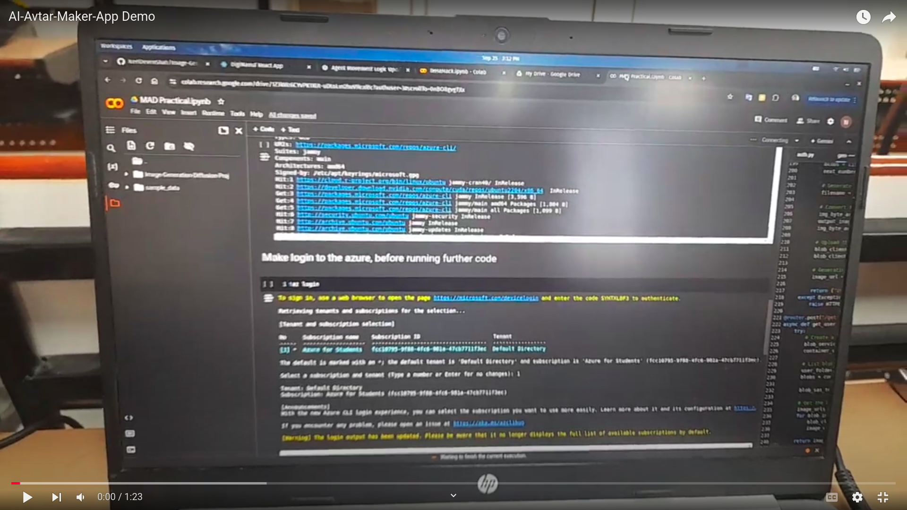

# AI Avatar Maker App

**AI Avatar Maker App** is a Flutter-based application that allows users to create realistic human avatars using AI technology. By collecting user input and feeding it into a powerful AI model, the app generates human-like images based on the given prompt. The cloud architecture behind this app enables users to generate these images with a simple click, ensuring a smooth and efficient experience.

## Features

- **Realistic Avatar Generation**: Create lifelike avatars based on user inputs.
- **AI-Powered**: Utilizes advanced AI models to deliver high-quality images.
- **Cloud-Driven**: Leverages cloud infrastructure for fast, on-demand image generation.
- **User-Friendly Interface**: Simple and intuitive design for seamless user experience.
- **On-Click Generation**: Instantly generate avatars with just one click.

## App Demo

[](https://youtu.be/bKuXaaJ9aqk?si=meGTfp_FH0ocqGOG)

## Installation

To install and run the app locally:

### Flutter Frontend

1. **Clone the repository**:

   ```bash
   git clone https://github.com/neeldevenshah/ai-avatar-maker-app.git
   ```

2. **Change the folder to frontend folder for frontend**

```bash
   cd Mobile Application
```

2. **Install dependencies**:

   ```bash
   flutter pub get
   ```

3. **Run the app**:

   ```bash
   flutter run
   ```

4. **For running backend**:
   Open new terminal and change to backend directory:

   ```bash
   cd AI_API
   ```

5. **Create a virtual environment**:

   ```bash
   python -m venv venv
   ```

6. **Activate the virtual environment**:
   On Windows:

   ```bash
   venv\Scripts\activate
   ```

   On macOS/Linux:

   ```bash
   source venv/bin/activate
   ```

7. **Install dependencies**:

   ```bash
   pip install -r requirements.txt
   ```

8. **Run the FastAPI server**:
   ```bash
   uvicorn main:app --reload
   ```

## Usage

- Open the Flutter app and provide the necessary input for your desired avatar.
- Click on the "Generate Avatar" button to create a realistic image based on your input.
- Your avatar will be generated and displayed within moments, thanks to the robust cloud infrastructure.

### FastAPI Backend

The backend for the AI Avatar Maker app is built using FastAPI. It handles API requests from the Flutter frontend and interacts with the AI model to generate avatars.

#### FastAPI Setup

- API Endpoints: The FastAPI server exposes endpoints for receiving user input and returning generated avatars.
- Scalable Architecture: FastAPI ensures efficient handling of requests and integrates seamlessly with the cloud infrastructure for image generation.

#### Running FastAPI

To run the FastAPI backend server:

1. Start the server:

   ```bash
   uvicorn main:app --reload
   ```

2. Access the API documentation at http://127.0.0.1:8000/docs.

## Contributing

Contributions are welcome! Feel free to open issues, submit pull requests, or suggest new features.

## License

This project is licensed under the MIT License. See the LICENSE file for details.

Feel free to adjust the URLs and details as needed!
